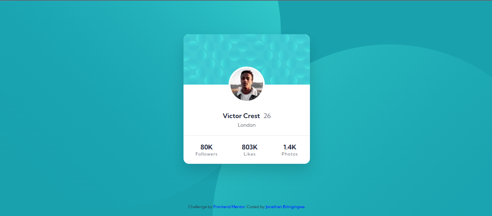

# Frontend Mentor - Profile card component solution

This is a solution to the [Profile card component challenge on Frontend Mentor](https://www.frontendmentor.io/challenges/profile-card-component-cfArpWshJ). Frontend Mentor challenges help you improve your coding skills by building realistic projects. 

## Table of contents

- [Overview](#overview)
  - [Screenshot](#screenshot)
  - [Links](#links)
  - [My process](#my-process)
  - [Built with](#built-with)
  - [What I learned](#what-i-learned)
  - [Challenges](#Challenges)
  - [Continued development](#continued-development)
  - [Acknowledgments](#acknowledgments)
  - [Author](#author)

  ## 📸 Screenshot

---

## Links

- Solution URL: https://www.frontendmentor.io/solutions/jonathan-profile-card-component-7c_k5C1YyX
- Live Site URL: https://freedev-group.github.io/jonathan-profile-card-component/

---

## Built With

- Semantic HTML5
- CSS3
- Flexbox
- Responsive design
- Google Fonts (Kumbh Sans)

---

## Overview

This project is a modern profile card component featuring:

- A top background pattern
- A centered profile image with overlapping effect
- User information (name, age, location)
- Social stats (followers, likes, photos)

The layout is fully responsive and adapts well across different screen sizes.

## What I Learned

Through this project, I improved my skills in:

- Structuring UI components using semantic HTML
- Using Flexbox for alignment and layout
- Creating overlapping elements with CSS
- Applying consistent spacing and typography
- Working with CSS variables for colors

## Challenges

Some challenges I encountered included:

- Positioning the profile image correctly with an overlapping effect
- Aligning the card content and spacing accurately
- Managing background images and layout responsiveness

I overcame these by adjusting CSS positioning, using margin offsets, and carefully structuring my layout.

## Continued Development

In future projects, I plan to:

- Improve pixel-perfect accuracy
- Enhance accessibility (ARIA roles, contrast)
- Add subtle animations for better user experience
- Write more scalable and reusable CSS

## Acknowledgments

Special thanks to Mentor Samuel and the FreeDev Community for their support and guidance throughout this project.

## Author

- GitHub - [Jonathan_Bitingingwa]https://bitingingwa.github.io/My-portfolio/
